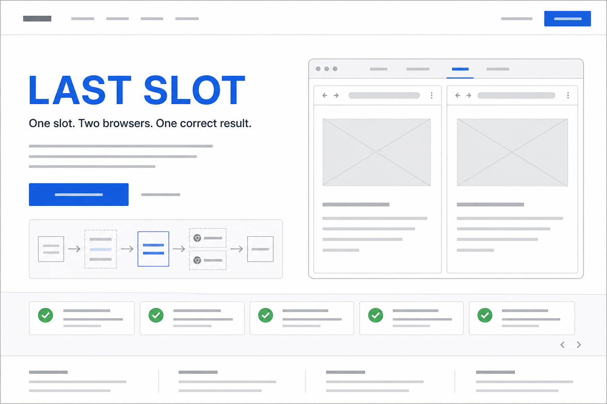

# Last Slot — Design Direction

Status: direction approved; detailed interface design is intentionally deferred.

## Thesis

Last Slot should look like a clear engineering case study, not a themed booking
product. A reviewer must understand the proposition, the two-browser race, and
the resulting proof without learning a visual metaphor first.

## Visual world

- Clean white canvas with generous negative space.
- Strong blue for identity and primary actions, near-black for explanatory copy,
  quiet gray for structure, and green only for verified outcomes.
- Large, direct title typography followed by the exact reliability claim:
  “One slot. Two browsers. One correct result.”
- Twin browser frames are the dominant visual evidence. They represent real,
  interactive sessions in the finished product, never decorative screenshots.
- A compact flow explains UI → gateway → service → database → visible readback.
- A proof strip carries factual checks and CI evidence; it must not become a row
  of invented metrics or testimonials.

## Intended page structure

1. Name, proposition, and one action to run or inspect the proof.
2. Side-by-side browser states showing the concurrent attempt.
3. The complete technical path and the invariant at the database boundary.
4. Verifiable evidence: Playwright report, trace, screenshots on failure, and CI.
5. Deliberate boundaries, implementation notes, and repository navigation.

## Translation rules

The approved image is a compositional direction, not a pixel specification.
Placeholder blocks become semantic Flutter controls and real application states.
Core UI text remains selectable and accessible. The browser comparison must
survive responsive layouts: paired on wide screens, ordered sequentially on
narrow screens. Color never carries status alone, focus is always visible, and
motion must respect reduced-motion preferences.

## Deferred decisions

Detailed type ramp, spacing tokens, component states, responsive breakpoints,
interaction motion, and final screenshots belong to the later UI milestone.
Until then, no generated mock may be presented as working product evidence.
