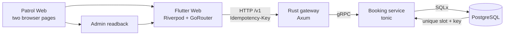

# Last Slot

**One slot. Two browsers. One correct result.**

Last Slot is an executable reliability case study. Two visitors try to book the
same final appointment. PostgreSQL permits exactly one winner; the losing
visitor sees an honest conflict. The repository is intentionally small and
uses synthetic data.

The guarantee is a unique constraint on `bookings.slot_id`, plus a second
unique constraint on the idempotency key. Proof is split: a Patrol browser
journey (visible confirmation, conflict, fresh-page readback, admin readback,
zero retries) and a separate HTTP/database proof. The browser journey does
not query PostgreSQL, does not use a test-only API endpoint, and does not
prove simultaneous arrival. An accessibility switch `?e2e=1` exists for the
browser test.

## What the browser journey proves

Patrol drives only visible, accessible product behavior:

1. Two independent browser pages enter different booking intents, one after
   the other.
2. One page shows the confirmed booking and the other shows the explicit
   conflict through the public Flutter interface.
3. Two fresh visitor pages read the persisted booked state through the same
   public API.
4. A fresh admin page visibly reads exactly one confirmed booking.
5. The journey runs with zero retries and records a trace for inspection.

The browser journey does not query PostgreSQL or use a test-only endpoint. It
proves that the behavior a user sees survives the complete application path.

## How the guarantee is verified

| Evidence layer | What it proves | What it deliberately does not claim |
| --- | --- | --- |
| PostgreSQL constraints | At most one booking per slot and one result per idempotency key | That every application layer presents the result honestly |
| HTTP/database integration proof | Barrier-released competing requests produce `201 + 409`, one durable row, and stable idempotent replay (`201 → 200`). Last full local run: 30 Aug 2026; its artifacts stay under the gitignored `build/` directory and are not in this repository. | Browser rendering, accessible interaction, or simultaneous arrival |
| Automated browser journey | Visible confirmation, visible conflict, fresh visitor readback, and admin readback through the real UI. Patrol submits one page after the other. | Database row counts or simultaneous request arrival |

Together they form one executable end-to-end argument without asking a UI test
to inspect implementation details that a user cannot observe.

## Run the complete evidence path

Prerequisites are Docker Compose, Flutter 3.44.2, and Node.js 22. Patrol manages
Chromium through its web runner.

```bash
bash scripts/e2e.sh
```

The command builds the Flutter app, starts the real containerized runtime,
verifies the HTTP/database invariants, runs the automated browser journey, and
tears the runtime down again. A successful run leaves an HTML report and trace;
a failed run retains screenshots, video, trace, HTTP/database evidence, and
service logs.

To inspect the local report:

```bash
open build/playwright/html/index.html
```

Public GitHub Actions and GitHub Pages are not part of the evidence. Run the
command locally. The [technical one-pager](docs/PORTFOLIO.md) explains the
design decisions and the [case-study brief](docs/CASE-STUDY.md) defines the
exact evidence boundary.

<details>
<summary>Run it with a coding agent</summary>

```text
Prepare and run the existing Last Slot browser-evidence demo without changing product code.

1. Read README.md and verify Docker Compose, Flutter 3.44.2, and Node.js 22.
2. Run bash scripts/e2e.sh from the repository root.
3. If it succeeds, open build/playwright/html/index.html.
4. Report the browser journey, HTTP/database result, retry count, retained artifacts, and any blocker. Do not infer evidence that the run did not produce.
```

</details>

## Architecture



The service count is intentional: the gateway demonstrates the browser-facing
contract and error mapping; the booking service owns the invariant. There is no
microservice zoo around a one-rule example.

## Reliability mechanisms

- A unique database constraint on the slot is the final double-booking guard.
- A second unique constraint makes retries with the same idempotency key return
  the original booking instead of executing twice.
- Documented failures remain honest HTTP outcomes with one stable,
  machine-readable error envelope and `Retry-After` (HTTP 503) when the booking
  service or its database is temporarily unavailable.
- The API is versioned under `/v1`; the checked-in OpenAPI contract documents
  every request, response, and failure.
- The HTTP/DB proof uses a process barrier to release competing requests, then
  verifies one durable row. A second real-stack request reuses one idempotency
  key and verifies `201 → 200`, the same booking ID, and one durable row.
- Patrol runs with zero retries and captures a trace on every run. A flaky pass
  is not hidden behind reruns.
- Container base images and GitHub Actions are pinned to immutable digests or
  commit SHAs.

See the [HTTP API contract](docs/API.md) and [OpenAPI document](openapi.yaml) for
the exact public semantics.

## Deliberate boundaries

Last Slot uses synthetic demonstration data. It has no authentication, payment
flow, Kubernetes deployment, customer claims, uptime claim, invented
benchmark, or published CI report. Those omissions keep the repository focused
on one complete, inspectable browser-to-database evidence path.


## License

MIT.

Part of Daniel Hopp's portfolio: https://daniel.hoppworks.de/ ·
https://www.linkedin.com/in/hoppworks
