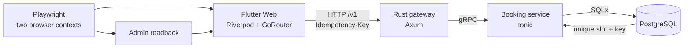

# Last Slot

**One slot. Two browsers. One correct result.**

Last Slot is an executable reliability case study built for engineering
reviewers. Two independent browser sessions try to book the same final
appointment. PostgreSQL permits exactly one winner, the losing browser receives
an honest conflict, and an admin view reads the persisted outcome through the
same public API.

The point is not that Playwright makes software reliable. The database
invariant, idempotent API, and explicit error semantics make the behavior
reliable. Playwright proves that those guarantees survive the complete user
journey.

> **Current milestone — executable proof:** the complete Flutter surface,
> PostgreSQL invariant, versioned API, Rust services, Docker topology, and a
> zero-retry two-browser Playwright journey are implemented. A fresh local run
> produces the HTML report and trace that substantiate this claim.

The approved visual direction is documented in [DESIGN.md](DESIGN.md), and the
complete reviewer narrative lives in [docs/CASE-STUDY.md](docs/CASE-STUDY.md).
The technical one-pager and implementation postmortem are collected in
[docs/PORTFOLIO.md](docs/PORTFOLIO.md).

## Target proof

Prerequisites are Docker, Flutter 3.44.2, Node.js 22, pnpm 11, and a local
Chromium installation managed by Playwright.

```bash
pnpm install
pnpm exec playwright install chromium
pnpm e2e:stack
```

The command builds the Flutter web app, starts the complete runtime with Docker
Compose, runs the two-browser journey with zero retries, writes the Playwright
HTML report and trace, and tears the runtime down again.

To inspect the local report:

```bash
pnpm e2e:report
```

CI runs the same command. Failed runs retain screenshots, video, trace, JUnit
output, and service logs as workflow artifacts; successful `main` runs publish
the Playwright HTML report on GitHub Pages.

## Setup and limits

The verified local target is macOS or Linux with Docker Compose, Flutter
3.44.2, Node.js 22, pnpm 11, and Chromium installed by Playwright. The demo
uses synthetic data and local containers; it is deployable as the supplied
Docker Compose stack, but is intentionally not an authenticated, public
multi-tenant booking product. The published web app and API share one origin:
Nginx serves the Flutter bundle and proxies `/v1` to the internal gateway, so
the browser never depends on its own `localhost`. See
[docs/PORTFOLIO.md](docs/PORTFOLIO.md) for
the negative case and presentation script.

## What the journey proves

The test interacts only through visible Flutter semantics:

1. Ada and Linus open the booking surface in separate browser contexts.
2. Both submit the same available slot concurrently.
3. One browser receives confirmation and one receives a conflict.
4. A fresh admin browser reads exactly one confirmed booking.
5. Both visitor pages refresh and still display the persisted booked state.

The test never queries PostgreSQL directly. A green result therefore proves the
same public path a user experiences instead of a test-only shortcut.

## Architecture



The service count is intentional: the gateway demonstrates the browser-facing
contract and error mapping; the booking service owns the invariant. There is no
microservice zoo around a one-rule example.

## Reliability mechanisms

- A unique database constraint on the slot is the final double-booking guard.
- A second unique constraint makes retries with the same idempotency key return
  the original booking instead of executing twice.
- Documented failures remain honest HTTP outcomes with one stable,
  machine-readable error envelope and `Retry-After` on temporary outages.
- The API is versioned under `/v1`; the checked-in OpenAPI contract documents
  every request, response, and failure.
- Playwright runs with zero retries and always captures a trace. A flaky pass is
  not hidden behind reruns.
- Container base images and GitHub Actions are pinned to immutable digests or
  commit SHAs.

See the [HTTP API contract](docs/API.md) and [OpenAPI document](openapi.yaml) for
the exact public semantics.

## Deliberate boundaries

Last Slot uses synthetic demonstration data. It has no authentication, payment
flow, Kubernetes deployment, customer claims, uptime claim, or invented
benchmark. Those omissions keep the repository focused on one complete,
inspectable invariant.


## License

MIT.
