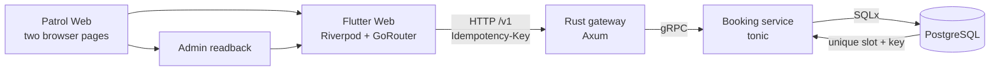

# Last Slot

**One slot. Two browsers. One correct result.**

Last Slot is an executable reliability case study. Two independent browser
sessions try to book the same final appointment. PostgreSQL permits exactly one
winner, the losing browser receives an honest conflict, and an admin view reads
the persisted outcome through the same public API.

The point is not that Patrol makes software reliable. The database
invariant, idempotent API, and explicit error semantics make the behavior
reliable. Patrol proves that those guarantees survive the complete user
journey.

> **Current milestone — executable proof:** the complete Flutter surface,
> PostgreSQL invariant, versioned API, Rust services, Docker topology, a
> barrier-synchronised HTTP/DB integration proof, and a zero-retry two-browser
> Patrol journey are implemented. A fresh local run produces their evidence.

The approved visual direction is documented in [DESIGN.md](DESIGN.md), and the
complete case-study narrative lives in [docs/CASE-STUDY.md](docs/CASE-STUDY.md).
The technical one-pager and implementation postmortem are collected in
[docs/PORTFOLIO.md](docs/PORTFOLIO.md).

## Verification routes

The app deliberately offers two routes: run the booking surface yourself, or
inspect the durable evidence. The public proof page links to the
[Patrol test source](https://github.com/hoppworks/last-slot/blob/main/apps/web/patrol_test/last_slot_test.dart).
The repository also contains the reproducible HTTP/DB proof in
[`scripts/http_integration.sh`](scripts/http_integration.sh).

## Target proof

Prerequisites are Docker, Flutter 3.44.2, and Node.js 22. Patrol manages
Chromium through its web runner.

```bash
bash scripts/e2e.sh
```

The command builds the Flutter web app, starts the complete runtime with Docker
Compose, releases two HTTP booking requests through a barrier, verifies the
database counts and idempotent replay, runs the two-browser journey with zero
retries, writes the Patrol HTML report and trace, and tears the runtime down
again.

To inspect the local report:

```bash
open build/playwright/html/index.html
```

CI runs the same command. Failed runs retain screenshots, video, trace, HTTP/DB
evidence, and service logs as workflow artifacts; successful `main` runs
publish the Patrol HTML report on GitHub Pages.

## Setup and limits

The verified local target is macOS or Linux with Docker Compose, Flutter
3.44.2 and Node.js 22. Patrol installs its browser runtime. The demo
uses synthetic data and local containers; it is deployable as the supplied
Docker Compose stack, but is intentionally not an authenticated, public
multi-tenant booking product. The published web app and API share one origin:
Nginx serves the Flutter bundle and proxies `/v1` to the internal gateway, so
the browser never depends on its own `localhost`. See
[docs/PORTFOLIO.md](docs/PORTFOLIO.md) for
the negative case and presentation script.

## What the journey proves

The test interacts only through visible Flutter semantics:

1. Ada and Linus open the booking surface in separate browser contexts.
2. The stack integration proof releases two HTTP requests for a separate
   fixture slot concurrently and verifies `201 + 409` and one database row.
3. The two browser pages visibly show one confirmation and one conflict.
4. Two fresh visitor pages visibly load the persisted booked state.
5. A fresh admin browser reads exactly one confirmed booking.

Patrol never queries PostgreSQL directly; it proves the same public path a user
experiences. The separate stack test queries the database only to prove the
durable invariant and idempotency contract that a browser cannot observe.

## Architecture



The service count is intentional: the gateway demonstrates the browser-facing
contract and error mapping; the booking service owns the invariant. There is no
microservice zoo around a one-rule example.

## Reliability mechanisms

- A unique database constraint on the slot is the final double-booking guard.
- A second unique constraint makes retries with the same idempotency key return
  the original booking instead of executing twice.
- Documented failures remain honest HTTP outcomes with one stable,
  machine-readable error envelope and `Retry-After` on temporary outages.
- The API is versioned under `/v1`; the checked-in OpenAPI contract documents
  every request, response, and failure.
- The HTTP/DB proof uses a process barrier to release competing requests, then
  verifies one durable row. A second real-stack request reuses one idempotency
  key and verifies `201 → 200`, the same booking ID, and one durable row.
- Patrol runs with zero retries and captures a trace on every run. A flaky pass
  is not hidden behind reruns.
- Container base images and GitHub Actions are pinned to immutable digests or
  commit SHAs.

See the [HTTP API contract](docs/API.md) and [OpenAPI document](openapi.yaml) for
the exact public semantics.

## Deliberate boundaries

Last Slot uses synthetic demonstration data. It has no authentication, payment
flow, Kubernetes deployment, customer claims, uptime claim, or invented
benchmark. Those omissions keep the repository focused on one complete,
inspectable invariant.


## License

MIT.
